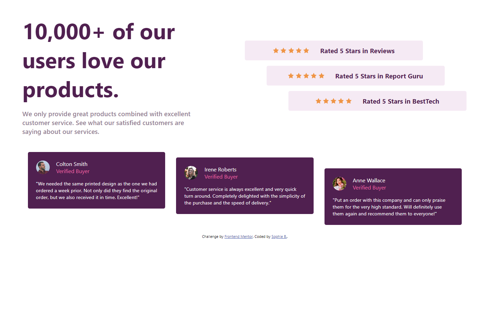
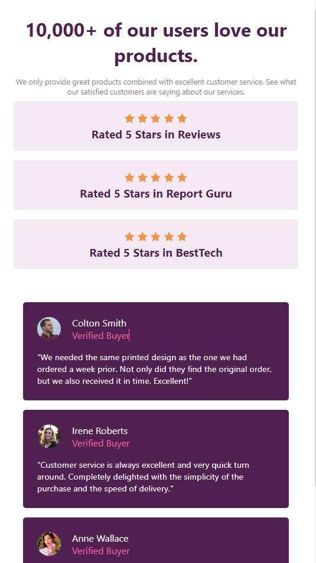

# Frontend Mentor - Social proof section solution
# Live Site URL: [Add live site URL here](https://smb78998.github.io/p_fm_social-proof-section-master/)

This is a solution to the [Social proof section challenge on Frontend Mentor](https://www.frontendmentor.io/challenges/social-proof-section-6e0qTv_bA). Frontend Mentor challenges help you improve your coding skills by building realistic projects. 

## Table of contents

- [Overview](#overview)
  - [The challenge](#the-challenge)
  - [Screenshot](#screenshot)
  - [Links](#links)
- [My process](#my-process)
  - [Built with](#built-with)
  - [What I learned](#what-i-learned)
  - [Useful resources](#useful-resources)
- [Author](#author)

## Overview

### The challenge

Users should be able to:

- View the optimal layout for the section depending on their device's screen size

### Screenshot

### Links

- Solution URL: [Add solution URL here](https://your-solution-url.com)
- Live Site URL: [Add live site URL here](https://smb78998.github.io/p_fm_social-proof-section-master/)

## My process

### Built with

- Semantic HTML5 markup
- CSS custom properties
- Flexbox
- CSS Grid

### What I learned

- CSS Grid
- Responsive Design

### Useful resources

- [Example resource 1](https://www.youtube.com/playlist?list=PL4cUxeGkcC9g9Vh9MAA-XKnfJsWZnPZFw) - This helped me for learn more about media quieres for responsive design

## Author

- Github - [smb78998](https://github.com/smb78998)
- Frontend Mentor - [@smb78998](https://www.frontendmentor.io/profile/smb78998)

